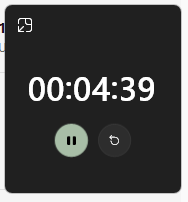
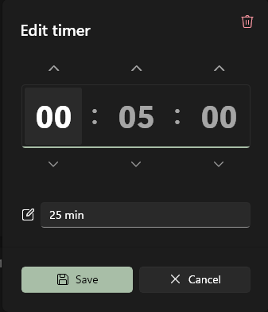

## Interval timer

A small web app **vibecoded in Cursor** to fill a personal gap: **Windows Clock’s timer has no loop**. The UI borrows the dark, minimal look of that timer (charcoal card, sage accents, round controls) but adds repetition on purpose.

### Why loop?

A **looped** countdown keeps re-anchoring attention: each lap is a gentle boundary. In practice that supports **stronger time awareness**, **less mind-wandering**, a **partial reset of vigilance**, and clearer **pacing** through the day—not one long open-ended stretch, but repeated “chunks” with an audible cue.

### Example use cases

| Duration | Idea |
|----------|------|
| **1 minute** | House chores—quick bursts, stay in motion |
| **5 minutes** | Computer tasks—bounded focus before reassessing |

(Anything you like; duration is editable.)

### Run

```bash
npm install
npm run dev
```

Open the URL Vite prints (usually `http://localhost:5173`). Production build: `npm run build` → output in `dist/`.

### GitHub Pages

Live site (after setup): **[https://guillaumekuc.github.io/interval-timer/](https://guillaumekuc.github.io/interval-timer/)**

1. In the repo on GitHub: **Settings → Pages**.
2. Under **Build and deployment**, set **Source** to **GitHub Actions** (not “Deploy from a branch”).
3. Push to `main`; the **Deploy GitHub Pages** workflow builds with `BASE_PATH=/interval-timer` and publishes `dist`.

First deploy may take a minute; refresh the Pages URL if you see 404. To test a production build locally:

```bash
# PowerShell
$env:BASE_PATH="/interval-timer"; npm run build; npm run preview
# Then open the printed URL — path includes /interval-timer/
```

### Features

- **Countdown** — `HH:MM:SS` until a beep; display shows whole seconds only.
- **Play / pause** — Single icon toggles by state.
- **Reset** — Back to the saved interval.
- **Loop** — When on, timer restarts after each completion (beeps each lap). Visual state: sage fill when enabled.
- **Picture-in-picture** — Separate small window where supported (Chromium Document PiP).
- **Edit** — Double-click the time; adjust with chevrons or typing; **Validate** applies and persists.
- **Persisted state** — Interval and loop preference in `localStorage`.

### Reference visuals

Main card | Edit overlay
:---:|:---:
 | 

Icons: [Font Awesome](https://fontawesome.com/) (free).
